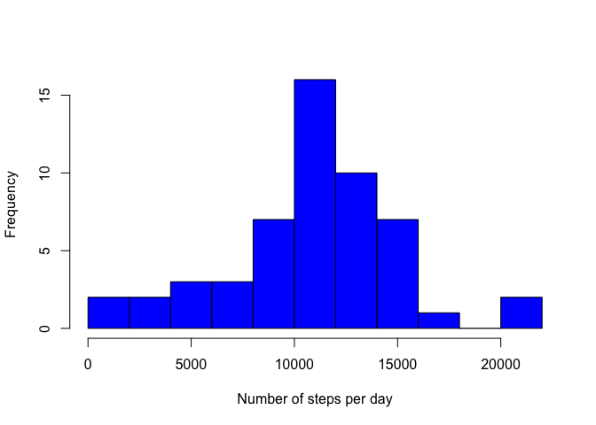
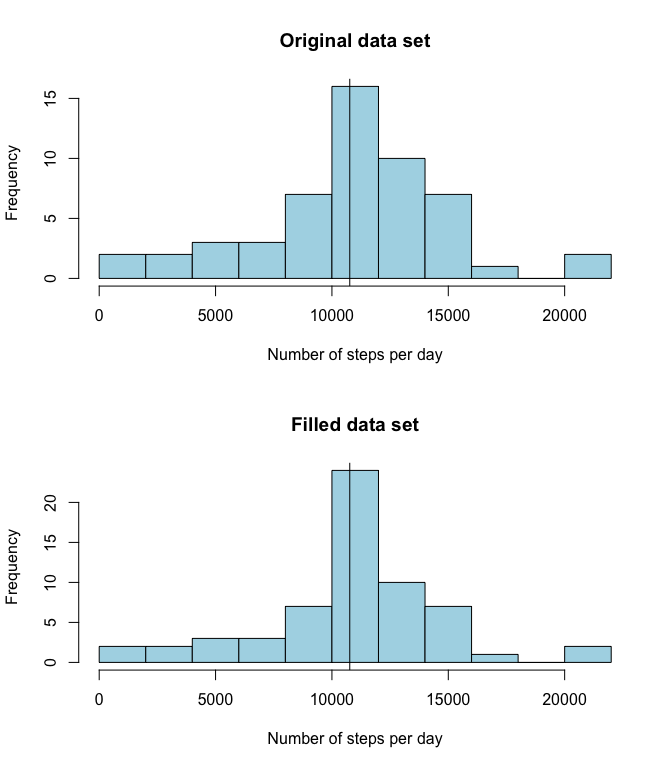
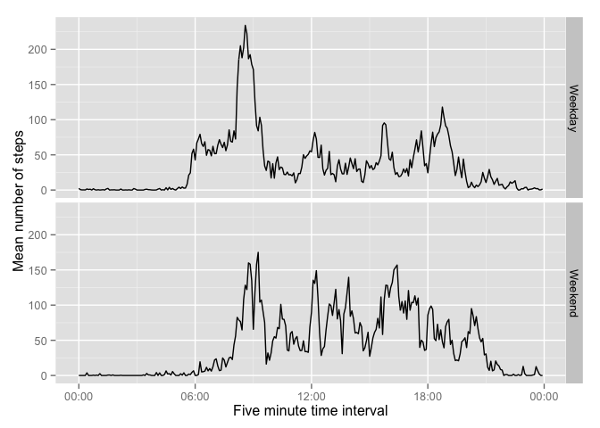

# Reproducible Research: Peer Assessment 1
This document describes the process and code that was followed to analyze activity data for a personal monitoring activity device. The data comes from [here](https://d396qusza40orc.cloudfront.net/repdata%2Fdata%2Factivity.zip) and is two months of activity data from an anonymous individual collected during the months of October and November, 2012.

The questions that we are trying to answer here are:

- What is the mean total number of steps taken per day by this individual?
- What is the average daily activity pattern of this individual?
- Are there any differences in the activity pattern between weekdays and weekends?

The code in this document will use several R packages that are not part of the R *base* package; so lets get them loaded now (ensure you have these packages installed before attempting this exercise):


```r
library(lubridate)
library(plyr)
library(ggplot2)
library(scales)
```

## Loading and preprocessing the data

Lets first extract the data from the *activity.zip* file, load it, and store it in an abject called *actdata* (for activity data):


```r
unzip("activity.zip")
actdata <- read.csv("activity.csv", h = TRUE)
head(actdata)
```

```
##   steps       date interval
## 1    NA 2012-10-01        0
## 2    NA 2012-10-01        5
## 3    NA 2012-10-01       10
## 4    NA 2012-10-01       15
## 5    NA 2012-10-01       20
## 6    NA 2012-10-01       25
```

Each row corresponds to a 5-minute interval of activity. There are three columns: *steps*,*date*, and *interval*. As described in the instructions for this exercise these correspond to:

- *steps*: number of steps taking during the five minute interval
- *date*: the date when the activity happened as yyyy-mm-dd
- *interval*: identifies the 5-minute interval for the activity

The *date* and *interval* columns are probably not in a date/time format, so they need to be converted first. First convert the date column using the **ymd** function in the *lubridate* package:


```r
actdata$date <- ymd(actdata$date)
class(actdata$date)
```

```
## [1] "POSIXct" "POSIXt"
```
Lets convert the interval variable to a time format of the type hh:mm. To do that,I first converted the *interval* into a 4-character text (e.g. '0000' instead of just '0'), and then converted that text into a hour minute format using *as.POSIXct*:


```r
#need to make this column 4 characters wide to convert to time
actdata$interval <- sprintf("%04d",actdata$interval)
actdata$interval <- as.POSIXct(strptime(actdata$interval,format="%H%M"))
head(actdata)
```

```
##   steps       date            interval
## 1    NA 2012-10-01 2014-07-20 00:00:00
## 2    NA 2012-10-01 2014-07-20 00:05:00
## 3    NA 2012-10-01 2014-07-20 00:10:00
## 4    NA 2012-10-01 2014-07-20 00:15:00
## 5    NA 2012-10-01 2014-07-20 00:20:00
## 6    NA 2012-10-01 2014-07-20 00:25:00
```

This adds the current date to the *column* but that should not affect the calculations.Ok, so now we are ready to analyze these data.

## What is mean total number of steps taken per day?

To calculate the total number of steps taken per day, lets use the function **tapply** on the *steps* column in *actdata* applying the function **sum** for each date to create the object *sumsteps*:


```r
sumsteps <- tapply(X = actdata$steps,INDEX = actdata$date,FUN = sum, na.rm = T)
head(sumsteps)
```

```
## 2012-10-01 2012-10-02 2012-10-03 2012-10-04 2012-10-05 2012-10-06 
##          0        126      11352      12116      13294      15420
```
But we do not want to include the days with no steps (because there were no data for those days); so lets exclude the zeroes from the *sumsteps* object:


```r
nonzeroIndx <- sumsteps > 0
sumsteps <- sumsteps[nonzeroIndx]
#verify we indeed have no zeroes
range(sumsteps)
```

```
## [1]    41 21194
```

This histogram shows the frequency distribution of the total number of steps taken per day 

```r
hist(sumsteps, breaks=10, col="blue", xlab="Number of steps per day", main = "")
```

 

The mean and median number of steps can be calculated easily:


```r
mean(sumsteps)
```

```
## [1] 10766
```

```r
median(sumsteps)
```

```
## [1] 10765
```

## What is the average daily activity pattern?
To calculate the average daily activity pattern, we use again the **tapply** function on the *steps* column, averaging by *interval* to create the *meansteps* object:


```r
meansteps <- tapply(actdata$steps, actdata$interval, mean, na.rm = T)
head(meansteps)
```

```
## 2014-07-20 00:00:00 2014-07-20 00:05:00 2014-07-20 00:10:00 
##             1.71698             0.33962             0.13208 
## 2014-07-20 00:15:00 2014-07-20 00:20:00 2014-07-20 00:25:00 
##             0.15094             0.07547             2.09434
```
The maximum number of meansteps is:

```r
max.meansteps <- max(meansteps)
max.meansteps
```

```
## [1] 206.2
```

```r
which(meansteps == max.meansteps)
```

```
## 2014-07-20 08:35:00 
##                 104
```

which occurs at the 8:35 interval. Before plotting the data, I convert the names in the meansteps object to a date-time format using **ymd_hms**, to ensure the times are plotted in the x axis:


```r
timestamp <- ymd_hms(names(meansteps)) 
```


```r
plot(timestamp,meansteps, t = 'l', xlab = "five-minute day interval", ylab = "mean number of steps per interval")
```

 

## Imputing missing values
There are some missing values in this data set, so it would be interesting to know what the effect of those missing values is on some of the results obtained previously. First lets calculate how many missing values there are:


```r
summary(actdata)
```

```
##      steps            date               interval                  
##  Min.   :  0.0   Min.   :2012-10-01   Min.   :2014-07-20 00:00:00  
##  1st Qu.:  0.0   1st Qu.:2012-10-16   1st Qu.:2014-07-20 05:58:45  
##  Median :  0.0   Median :2012-10-31   Median :2014-07-20 11:57:30  
##  Mean   : 37.4   Mean   :2012-10-31   Mean   :2014-07-20 11:57:30  
##  3rd Qu.: 12.0   3rd Qu.:2012-11-15   3rd Qu.:2014-07-20 17:56:15  
##  Max.   :806.0   Max.   :2012-11-30   Max.   :2014-07-20 23:55:00  
##  NA's   :2304
```
We can see here that  there are 2304 missing values in the *steps* column.

To fill these missing values I will use the average number of steps taken at that time interval. Fortunately these values were already calculated and are stored in the object *meansteps*. First, I create a small function that takes a row of activity data with a missing value in the *steps* column from *actdata* and fills in the missing value by matching the corresponding mean value of steps from *meansteps*. This function is called **fillSteps**:


```r
fillSteps <- function(datarow,meanobject=meansteps) {
        interval <- datarow[3]
        index <- which(names(meanobject) == interval)
        meanobject[index]
}          
```
**fillSteps** takes two arguments: *datarow*, which is a row of data coming from *actdata* that has a missing steps value, and *meanobject* which is an object that contains the mean number of steps for each five minute interval (in our case *meansteps*, so I make this the default). Lets test the function:


```r
actdata[1,] # first row is missing the number of steps
```

```
##   steps       date   interval
## 1    NA 2012-10-01 2014-07-20
```

```r
fillSteps(actdata[1,])
```

```
## 2014-07-20 00:00:00 
##               1.717
```

```r
head(meansteps)
```

```
## 2014-07-20 00:00:00 2014-07-20 00:05:00 2014-07-20 00:10:00 
##             1.71698             0.33962             0.13208 
## 2014-07-20 00:15:00 2014-07-20 00:20:00 2014-07-20 00:25:00 
##             0.15094             0.07547             2.09434
```
So the function works fine!

Now, I will use this function to fill in all the missing values in the data set. But first, I duplicate the original data set so I can compare it to this new filled-in data set which I am going to call *actdata.filled*:


```r
actdata.filled <- actdata
```

Now, lets find were those missing values are:


```r
missvalues <- is.na(actdata.filled[, 1])
```
Using the function **apply** and the new function **fillSteps** I can replace all the missing values using the following code:


```r
actdata.filled[missvalues,1] <- apply(actdata.filled[missvalues,], 1, fillSteps)
head(actdata.filled)
```

```
##     steps       date            interval
## 1 1.71698 2012-10-01 2014-07-20 00:00:00
## 2 0.33962 2012-10-01 2014-07-20 00:05:00
## 3 0.13208 2012-10-01 2014-07-20 00:10:00
## 4 0.15094 2012-10-01 2014-07-20 00:15:00
## 5 0.07547 2012-10-01 2014-07-20 00:20:00
## 6 2.09434 2012-10-01 2014-07-20 00:25:00
```

Lets verify there are no more missing values:


```r
sum(is.na(actdata.filled$steps))
```

```
## [1] 0
```
Ok, so does filling the missing values has any effect on the frequency distribution of the total daily number of steps? First calculate the total daily number of steps for the new "filled" data set:


```r
sumsteps.filled <- tapply(actdata.filled$steps, actdata.filled$date, sum)
head(sumsteps.filled)
```

```
## 2012-10-01 2012-10-02 2012-10-03 2012-10-04 2012-10-05 2012-10-06 
##      10766        126      11352      12116      13294      15420
```

Lets compare the frequency distribution of the daily number of steps for both data sets


```r
par(mfrow=c(2,1))
hist(sumsteps, breaks = 10, col = "lightblue", xlab = "Number of steps per day", main = "Original data set")
abline(v = mean(sumsteps), lty=1)

hist(sumsteps.filled, breaks = 10, col = "lightblue", xlab = "Number of steps per day", main = "Filled data set")
abline(v = mean(sumsteps.filled), lty=1)
```


The mean and median total number of steps for the filled data set are 1.0766 &times; 10<sup>4</sup> and 1.0766 &times; 10<sup>4</sup>; almost identical to the mean and median of the original data set (1.0766 &times; 10<sup>4</sup> and 10765 respectively).

## Are there differences in activity patterns between weekdays and weekends?

To examine this question, I first create a new function that figures out whether a date falls in a weekend or weekday:


```r
# Function to figure out whether a date falls in a weekend or weekday
dayType <- function(date){
        require(lubridate)
        dayn <- wday(date)
        if(dayn == 1 | dayn == 7)
                return("Weekend")
        else
                return("Weekday")
}
```

I then use the **sapply** function to calculate this over the two dates and store the value in a new column called dayType:


```r
actdata$dayType <- sapply(X = actdata$date, FUN = dayType)
```

Then I used function **ddply** from package *plyr* to calculate the average daily activity by hour interval and day type (weekend or weekday) and store it in a new object called *actbydt* (activity by day type):


```r
actbydt <- ddply(actdata, .(dayType, interval), summarize, meanAct = mean(steps, na.rm=T))
head(actbydt)
```

```
##   dayType            interval meanAct
## 1 Weekday 2014-07-20 00:00:00  2.3333
## 2 Weekday 2014-07-20 00:05:00  0.4615
## 3 Weekday 2014-07-20 00:10:00  0.1795
## 4 Weekday 2014-07-20 00:15:00  0.2051
## 5 Weekday 2014-07-20 00:20:00  0.1026
## 6 Weekday 2014-07-20 00:25:00  1.5128
```
Finally, I use **ggplot** to plot the results:


```r
plot <- ggplot(actbydt, aes(x = interval, y = meanAct)) + facet_grid(dayType~.) + geom_line() + scale_x_datetime(labels = date_format("%H:%M"))
plot <- plot + xlab("Five minute time interval") + ylab("Mean number of steps") 
print(plot)
```


There are some interesting differences in the activity of this individual between weekend and weekday. During the weekday, the individual takes more steps during the morning than the rest of the day, but during the weekend the number of steps seems more even and higer during throughout the day (with still a little peak during the morning).
